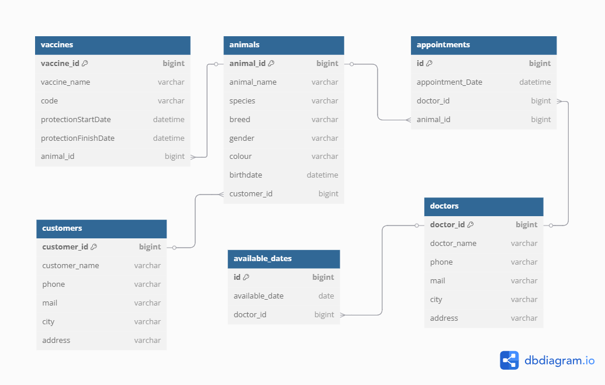

# Veterinary Management System

Veteriner klinikleri için geliştirilen bu sistem, müşteri, hayvan, doktor, randevu, aşı ve uygun tarihler gibi verilerin yönetimini sağlar. Bu proje; PostgreSQL veritabanı, RESTful API uç noktaları ve Postman koleksiyonu içerir.

---

## Kullanılan Teknolojiler

- **Java 21** – Backend dili
- **Spring Boot 3.5.0** – RESTful API geliştirme çerçevesi
- **Maven** – Proje yönetimi ve bağımlılık yönetimi
- **MapStruct & Lombok** – DTO/Entity dönüştürme ve kod sadeleştirme
- **PostgreSQL 17.3** – Veritabanı
- **Postman** – API testi ve koleksiyon yönetimi

---

## Özellikler

- Müşteri (Customer) yönetimi
- Hayvan (Animal) takibi
- Veteriner (Doctor) kaydı
- Randevu (Appointment) planlama ve filtreleme
- Aşı (Vaccine) geçmişi takibi
- Uygun günlerin (Available Dates) yönetimi

## 🔐 Kimlik Doğrulama (Authentication)

Bu projeye JWT tabanlı kimlik doğrulama eklenmiştir. Kullanıcılar giriş yaptıktan sonra kendilerine bir **access token** ve **refresh token** verilir. Tüm korumalı API uç noktalarına erişim için geçerli bir access token gereklidir.

---

### Uç Noktalar

- `POST /register` – Yeni kullanıcı kaydı yapar  
- `POST /authenticate` – Kullanıcı adı ve şifre ile giriş yapar, access ve refresh token döner  
- `POST /refresh-token` – Geçerli refresh token ile yeni access token alır

---

### Kullanım Akışı

1. **Kayıt:**  
   Yeni kullanıcı oluşturmak için `/register` endpoint’i kullanılır.

2. **Giriş:**  
   `/authenticate` endpoint’i üzerinden giriş yapıldığında access ve refresh token döner.

3. **Token ile Erişim:**  
   Korunan tüm endpoint’lere erişmek için `Authorization: Bearer <access_token>` header’ı kullanılır.

4. **Token Yenileme:**  
   Access token süresi dolduğunda, `refresh-token` endpoint’i ile yeni bir access token alınabilir.

---

### Güvenlik Notları

- `/register`, `/authenticate` ve `/refresh-token` uç noktaları dışındaki tüm uç noktalar JWT ile korunmaktadır.
- `JwtAuthenticationFilter`, gelen isteklerdeki token’ları doğrular.
- Session yönetimi stateless’tir.

---

# Proje Kurulumu

## Java Uygulamasını Çalıştırma

### 1. Projeyi Klonlayın veya İndirin

```bash
git clone https://github.com/mehmetk-dev/vet-management-system.git
cd vet-management-system
```

### 2. Maven Bağımlılıklarını Yükleyin

```bash
mvn clean install
```

### 3. Uygulamayı Başlatın

```bash
mvn spring-boot:run
```

> Uygulama başarıyla başlatıldığında `http://localhost:8080` üzerinden API isteklerini almaya hazır olur.

### 4. application.properties Örneği

`src/main/resources/application.properties` içinde aşağıdaki gibi bir yapı olmalı:

```properties
spring.datasource.url=jdbc:postgresql://localhost:5432/VeterinaryBase
spring.datasource.username=postgres
spring.datasource.password=parolanız
spring.jpa.hibernate.ddl-auto=none
spring.jpa.show-sql=true
spring.jpa.properties.hibernate.format_sql=true
```

---

## Veritabanı Kurulumu

### 1. PostgreSQL Kurulumu

Eğer sisteminizde PostgreSQL yüklü değilse, [https://www.postgresql.org/download/](https://www.postgresql.org/download/) adresinden indirip kurabilirsiniz.

### 2. Yeni Veritabanı Oluşturma

#### pgAdmin üzerinden:

- pgAdmin’i açın
- Sol menüde `Databases` → Sağ tık → **Create → Database**
- Örn: `VeterinaryBase` olarak adlandırın

#### Terminal üzerinden:

```bash
createdb -U postgres VeterinaryBase
```

### 3. `veterinary_database.sql` Dosyasını Yükleme

#### Yöntem 1: pgAdmin (GUI)

- Yeni oluşturduğun veritabanına sağ tık → **Query Tool**
- `veterinary_database.sql` dosyasını aç ve çalıştır (Run ▶️)

#### Yöntem 2: Terminal

```bash
psql -U postgres -d VeterinaryBase -f ./veterinary_database.sql
```

> Bu adım sonunda tüm tablolar ve örnek veriler veritabanına yüklenecektir.

---

## Postman Koleksiyonu Kurulumu

### 1. Postman Kurulumu

[https://www.postman.com/downloads/](https://www.postman.com/downloads/) adresinden Postman’i indirip kurun.

### 2. Koleksiyonu İçe Aktarın

#### A. `.json` dosyasını kullanarak:

1. Postman’i açın
2. Sol üstte **File → Import** seçin
3. `Veteriner.postman_collection.json` dosyasını seçin
4. Koleksiyonlar bölümünde proje görünecektir

### 3. API Testi

- Tüm istekler `http://localhost:8080` adresine yönlendirilmiştir
- Backend uygulamanız 8080 portunda çalışır durumda olmalıdır
- `GET`, `POST`, `PUT`, `DELETE` istekleri hazırdır

---

## API Modülleri

### Customer

- `POST /v1/customers` → Yeni müşteri oluşturur
- `GET /v1/customers/{id}` → Belirli bir müşteriyi getirir
- `PUT /v1/customers/{id}` → Müşteri bilgilerini günceller
- `DELETE /v1/customers/{id}` → Müşteriyi siler
- `GET /v1/customers` → Tüm müşterileri veya filtrelenmiş veriyi listeler
- `GET /v1/customers/{id}/animals` → Müşterinin sahip olduğu hayvanları getirir
- `GET /v1/customers/{id}/animals/vaccines/filter` → Hayvanların aşılarını tarih aralığına göre filtreler

### Animal

- `POST /v1/animals` → Yeni hayvan kaydı ekler
- `GET /v1/animals/{id}` → Hayvan bilgilerini getirir
- `PUT /v1/animals/{id}` → Hayvan bilgisini günceller
- `DELETE /v1/animals/{id}` → Hayvan kaydını siler
- `GET /v1/animals?pageSize=X` → Sayfalı olarak hayvanları listeler
- `GET /v1/animals?name=xxx` → İsme göre hayvanları filtreler
- `GET /v1/animals/{id}/customer` → Hayvan sahibini getirir

### Doctor

- `POST /v1/doctors` → Yeni doktor kaydı
- `GET /v1/doctors/{id}` → Doktor bilgisi
- `PUT /v1/doctors/{id}` → Güncelleme
- `DELETE /v1/doctors/{id}` → Silme
- `GET /v1/doctors` → Sayfalama destekli listeleme

### Appointment

- `POST /v1/appointments` → Randevu oluşturur
- `GET /v1/appointments/{id}` → Randevu detaylarını getirir
- `PUT /v1/appointments/{id}` → Randevuyu günceller
- `DELETE /v1/appointments/{id}` → Randevuyu siler
- `GET /v1/appointments?page=0&pageSize=X` → Sayfalı listeleme
- `GET /v1/appointments/{doctorId}/filter-by-doctor?startDate=...&endDate=...` → Doktora ait randevuları tarih aralığına göre filtreler
- `GET /v1/appointments/{animalId}/filter-by-animal?startDate=...&endDate=...` → Hayvana ait randevuları tarih aralığına göre filtreler

### Vaccine

- `POST /v1/vaccines` → Yeni aşı kaydı
- `GET /v1/vaccines/{id}` → Aşı bilgisi getirir
- `PUT /v1/vaccines/{id}` → Güncelleme
- `DELETE /v1/vaccines/{id}` → Silme
- `GET /v1/vaccines?page=0&pageSize=X` → Listeleme
- `GET /v1/animals/{animalId}/vaccines` → Belirli hayvanın aşılarını listeler

### Available Dates

- `POST /v1/available-dates` → Yeni uygun gün ekler
- `GET /v1/available-dates/{id}` → Tarih bilgisi getirir
- `PUT /v1/available-dates/{id}` → Günceller
- `DELETE /v1/available-dates/{id}` → Silme
- `GET /v1/available-dates?page=0&pageSize=X` → Listeleme

---

## Veritabanı ER Diyagramı

Aşağıdaki ER diyagramı, sistemdeki veritabanı tablolarının birbirleriyle olan ilişkilerini göstermektedir.



Proje incelediğiniz için teşekkür ederim.
